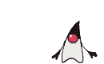

# Seed Detector

Software for detecting/measuring and statistics generation for seed distribution. 

For reference of how things work see the python version since its better documented.

### [Python](python/ "Python Prototype")

To install the python dependencies use:

```console
$ pip install -r requirements.txt
```

#### Usage:

```console
$ ./seed_tracker [-f | --file=] [-k | --kernel=] [-s | --scale=]
```

Running `test.sh` will start the tracker in a pre-configured state,
using one of the provided [videos](videos/ "Seed Videos").

```console
$ ./test.sh
```

There is also a script `video_maker.py` to generate videos of
predetermined seed distributions, this is useful for testing the
tracker without the variables added by the extraction of the seed from
the image.

#### Flags & key-binds:

* `[-f | --file=]` - The file name to be used as video source. Use `-d` to use a hardware device.
* `[-k | --kernel=]` - The size of the kernel to be used to blur the
  image, this number must be odd.
* `[-s | --scale=]` - How much to scale the image down in 1 to 100% scale 100 beeing max.
* `[-p | --pixel=]` - How many pixels are equal to 1cm. Defaults to 10.
* `[-F | --Fault=]` - The maximum size of a fault. Defaults to 50.
* `[-D | --Double=]` - The minimum size of a double. Defaults to 150.
* `[-c]` - Will start the program in calibration mode. this It may not
  work very well, since the GUI options for opencv are very limited.
* `[-h]` - Use a hardware device indicated by `--file=`.
* `[-d | --dir=]` - The direction the videos is playing, or, the
  direction the camera is moving. Can be: up, down, left or right.

| key-bind | function                                                                 |
|:--------:|:-------------------------------------------------------------------------|
| q        | Exits the program.                                                       |
| p        | Pauses the video.                                                        |
| r        | Displays the results, this will happen automatically if the videos ends. |
| s        | Starts the program(if in calibration mode).                              |

**NOTE:** The higher the FPS of the video fed the to program the
better the results, also, if your camera has white-balance and
auto-focus, turn those off. The tracker right now is a little
sensitive, and requires manual calibration to obtain good
results.

### [Android](android/ "Android Version")


To build import the project in android-studio and go from there.

**NOTE:** You **MUST use the provided OpenCV sdk** since it contains
modifications thay may cause the program not to work otherwise.
